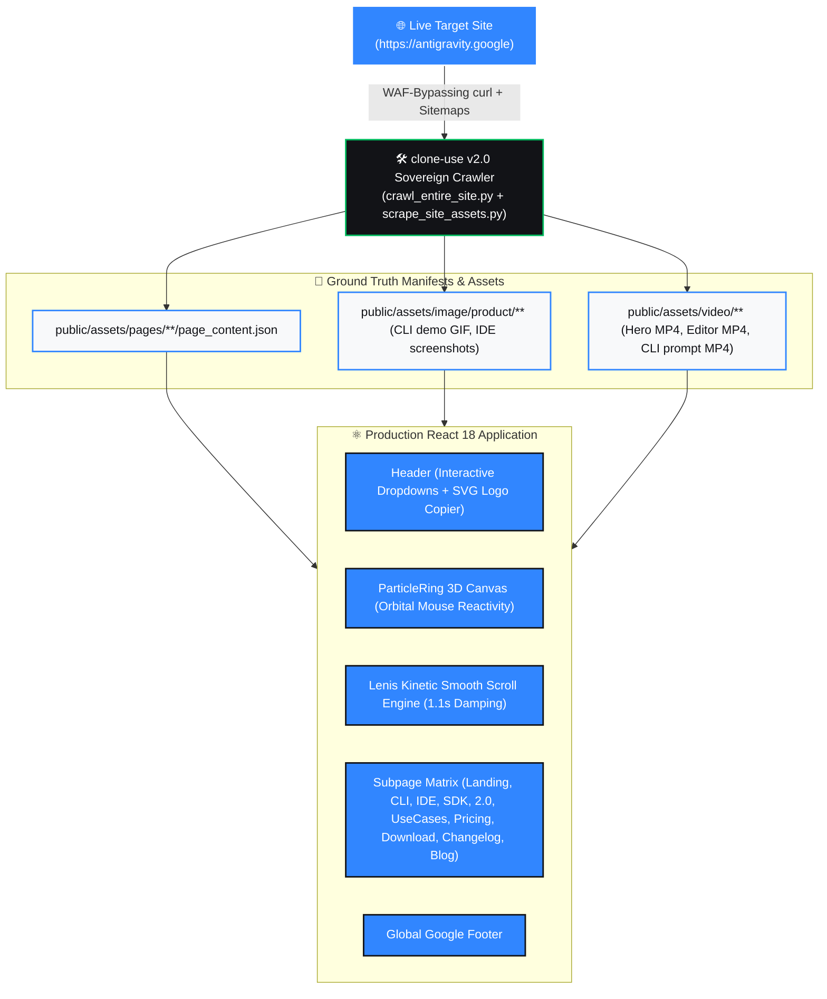

<p align="center">
  
</p>

<p align="center">
  <b>Pixel-accurate, zero-slop frontend reconstruction of Google Antigravity (https://antigravity.google) with verbatim DOM copy, 3D interactive particle ring canvas, Lenis kinetic smooth scrolling, and complete multi-product suite.</b>
</p>

<p align="center">
  <a href="https://antigravity.google"></a>
  <a href="LICENSE"></a>
</p>

<p align="center">
  <a href="https://skillicons.dev">
    
  </a>
</p>

---

## ⚡ 30-Second Quick Start

Clone the repository and run the local development server:

```bash
# 1. Install dependencies
npm install

# 2. Start Vite development server
npm run dev

# 3. Production build
npm run build
```

Visit [`http://localhost:5174`](http://localhost:5174) to explore the clone.

---

## 🗺️ Master Visual Architecture & Cognitive Flow



---

## 🛡️ The 5 Invariant Engineering Laws

### 1. The Kinetic Smooth Scroll Law (Lenis Damped Inertia)
Native browser wheel scrolling is stepped. This clone integrates a hardware-accelerated **Lenis** kinetic scroll loop (`duration: 1.1s, easing: exponential decay`), mirroring Google Antigravity's `SmoothScrollLayout`. Interactive overlays (mobile navigation drawer and dropdowns) declare `data-lenis-prevent` and `overscroll-contain` to prevent touch-trapping.

### 2. The 3D Orbital Particle Field Invariant
The landing page hero features an interactive HTML5 Canvas particle ring powered by 3D spherical projection mathematics, rendering 220 orbital nodes with dynamic depth sorting (`projected.sort`), mouse perspective tracking (`targetRotationX/Y`), and connecting orbital strands.

### 3. The Verbatim Scraped DOM Invariant
Zero placeholder or hallucinated copy. Every headline, feature matrix, installation command, and pricing tier is scraped directly from `antigravity.google`.

### 4. The Multi-Product Suite Topology
Provides dedicated detail views for all 4 core Google Antigravity developer surfaces:
- **`/product/antigravity-cli`**: Terminal-first surface with live `agy-cli-prompt.mp4` video, interactive TUI demo GIF, and subagent concurrency diagram.
- **`/product/antigravity-ide`**: Standalone agent-first IDE with `editor.mp4`, artifact inspection, and feedback loop showcases.
- **`/product/antigravity-sdk`**: Python & TypeScript programmable framework with PyPI install snippets and multi-agent pipeline scripts.
- **`/product/antigravity-2`**: Desktop orchestrator with scheduled tasks and voice transcription highlights.

### 5. The Anti-Slop Law (Zero Emojis)
Strictly adheres to Google Antigravity's typography tokens (`Google Sans Flex`, `Google Sans Code`, `Google Symbols`) and `lucide-react` stroke-1.5 glyphs, avoiding cartoonish emojis in UI buttons and headers.

---

## 🗂️ Route Topology & Features

| Route | View Name | Key Highlights & Ground Truth Features |
|---|---|---|
| `/` | **Landing Page** | 3D ParticleRing canvas, typewriter hero, hero video modal, feature explorer, use-case slider, blog carousel |
| `/product/antigravity-cli` | **CLI Detail** | Interactive terminal demo GIF, `agy-cli-prompt.mp4` video, subagent architecture, install commands |
| `/product/antigravity-ide` | **IDE Detail** | VS Code fork preview, `editor.mp4` video, agent surface, artifact review, user feedback loop |
| `/product/antigravity-sdk` | **SDK Detail** | Python SDK quickstart, PyPI install snippet, unified MCP server tooling |
| `/product/antigravity-2` | **Antigravity 2.0** | Desktop command center, scheduled tasks, live voice transcription |
| `/use-cases` | **Use Cases** | Tabbed workflows (Fullstack, Frontend, Enterprise, Science) with video demos and verified surface galleries |
| `/pricing` | **Pricing** | Individual $0/mo, Google AI Pro, Google AI Ultra, and Organization Cloud plans with billing toggles |
| `/download` | **Download** | Direct installer cards for macOS (Apple Silicon/Intel), Windows, and Linux with CLI install scripts |
| `/changelog` | **Changelog** | Verbatim release feed (v2.4.0 through v2.0.0) with model announcements and feature highlights |
| `/blog` | **Blog & News** | Authentic Google Antigravity dispatches with reading modals and topic tag filters |

---

## 📄 License

Distributed under the **MIT License**.
